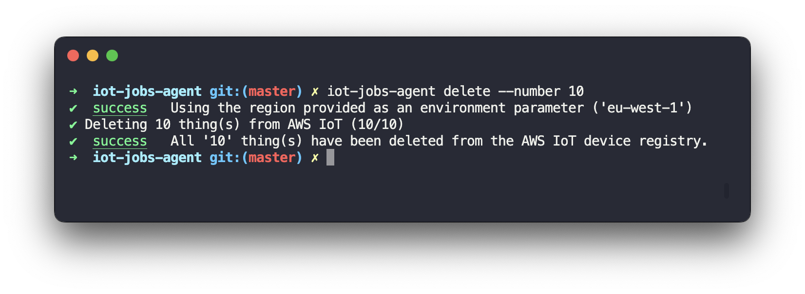
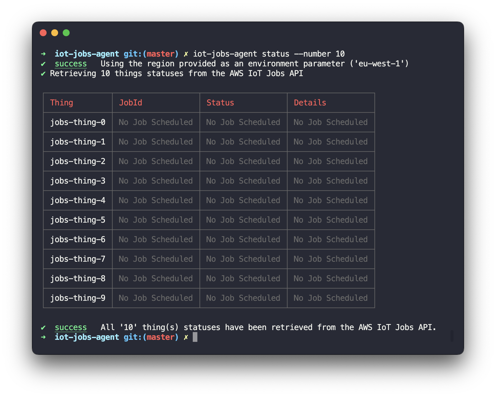
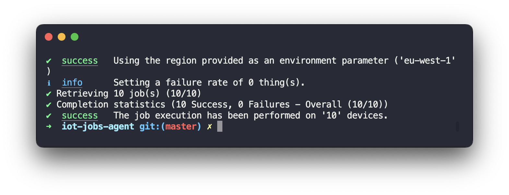

<br /><br /><br /><br />
<p align="center">
  
</p>
<br /><br />

# iot-jobs-agent
> A simulation AWS IoT Jobs agent that can process jobs for thousands of devices and report a state to AWS IoT Jobs.

Current version: **1.0.0**

## 📋 Table of content

- [Installation](#-install)
- [Description](#-description)
- [Usage](#usage)
- [Provisionning AWS credentials](#provisioning-aws-credentials)
- [Using a specific regions](#using-a-specific-region)

## 🚀 Install

```bash
npm install --global iot-jobs-agent
```

Once installed, you can verify that the package was successfully installed by running the following command.

```bash
iot-jobs-agent --version
```

## 🔰 Description

The device agent is a Node.js application providing a way for developers, architects and DevOps teams to test a deployment of [AWS IoT Jobs](https://docs.aws.amazon.com/iot/latest/developerguide/iot-jobs.html) at scale by simulating the behavior of a real device.

When used, the device agent allows you to create as many virtual thing(s) as needed in the AWS IoT device registry, and to download jobs from the AWS IoT Jobs data plane, potentially execute the jobs locally, and report back a state to the data plane.

## 📘 Usage

> You will find [here](./TUTORIAL.md) a tutorial describing a step-by-step process to use the device agent.

### Creating devices

The `iot-jobs-agent` package provides a convenient way to create virtual devices in the AWS IoT device registry to simulate a large fleet of devices. To create devices, you just need to tell the agent how many it should create.

```bash
# The below example will create 10 things in your AWS IoT device registry.
iot-jobs-agent create --number 10
```

<br />
<p align="center">
  
</p>

> All things created by the agent will have the attribute `device_simulator` set to the value `true`.

#### Parameters

- `--number`: the number of virtual devices to delete.

### Deleting devices

To delete previously created devices, you can use the `delete` command.

```bash
# The below example will delete 10 things previously created by the agent.
iot-jobs-agent delete --number 10
```

<br />
<p align="center">
  
</p>

#### Parameters

- `--number`: the number of virtual devices to create.

### Retrieving device jobs status

The agent allows you to list the jobs available for a created fleet of virtual devices.

```bash
iot-jobs-agent status --number 10
```

<br />
<p align="center">
  
</p>

#### Parameters

- `--number`: the number of virtual devices to retrieve the job status from.

### Executing jobs

The agent is able to simulate the execution of jobs on a fleet of virtual devices.

```bash
iot-jobs-agent execute --number 10
```

<br />
<p align="center">
  
</p>

#### Parameters

- `--number`: the number of virtual devices to executes the job from.
- `--failure-rate`: the percentage of jobs to fail.
- `--min-delay`: an optional minimum delay (in milliseconds) to use when executing jobs.
- `--max-delay`: an optional maximum delay (in milliseconds) to use when executing jobs.

## Provisionning AWS credentials

The `iot-jobs-agent` needs to retrieve STS tokens from AWS in order to interact with services on your account. The easiest way to achieve this is to have the [AWS CLI](https://aws.amazon.com/fr/cli/) installed **and** configured on your development or deployment machine.

> Read more on [Installing the AWS CLI](https://docs.aws.amazon.com/cli/latest/userguide/installing.html) and [Configuring the AWS CLI](https://docs.aws.amazon.com/cli/latest/userguide/cli-chap-getting-started.html).

If you happen to have the AWS CLI installed and configured with valid credentials on your local machine, the `iot-jobs-agent` will automatically use these credentials to authenticate against the AWS services it is making requests against.

### Using AWS Profiles

If you have configured the AWS CLI with different [profiles](https://docs.aws.amazon.com/cli/latest/userguide/cli-configure-profiles.html), it is possible to explicitly specify an AWS profile to use with the `iot-jobs-agent` by specifying the `AWS_PROFILE` variable in your environment such as in the following example.

```bash
AWS_PROFILE=my-custom-profile node jobs-agent.js <command>
```

### Specifying custom AWS credentials

If you do not have the AWS CLI installed or configured, or you would like to use the `jobs-agent` with custom credentials, you can pass your `AWS_ACCESS_KEY_ID` and your `AWS_SECRET_ACCESS_KEY` as environment variables of the `jobs-agent` such as in the following example :

```bash
$ AWS_ACCESS_KEY_ID=<access-key-id> AWS_SECRET_ACCESS_KEY=<secret-access-key> node jobs-agent.js <command>
```

> If you are using temporary credentials you can also specify an `AWS_SESSION_TOKEN` additionally to the aforementioned variables.

## Using a specific region

By default, the `jobs-agent` will use the AWS region specified in your `default` profile in case you have installed and configured AWS CLI. Alternatively, the region to use can be explicitly specified by setting the `AWS_REGION` environment variable.

```bash
$ AWS_REGION=us-east-1 node jobs-agent.js <command>
```

If you do not have the AWS CLI configured with a specific region to use, and no environment variable is specified for the region to use, the `jobs-agent` will output a warning and use the `eu-west-1` region by default.
